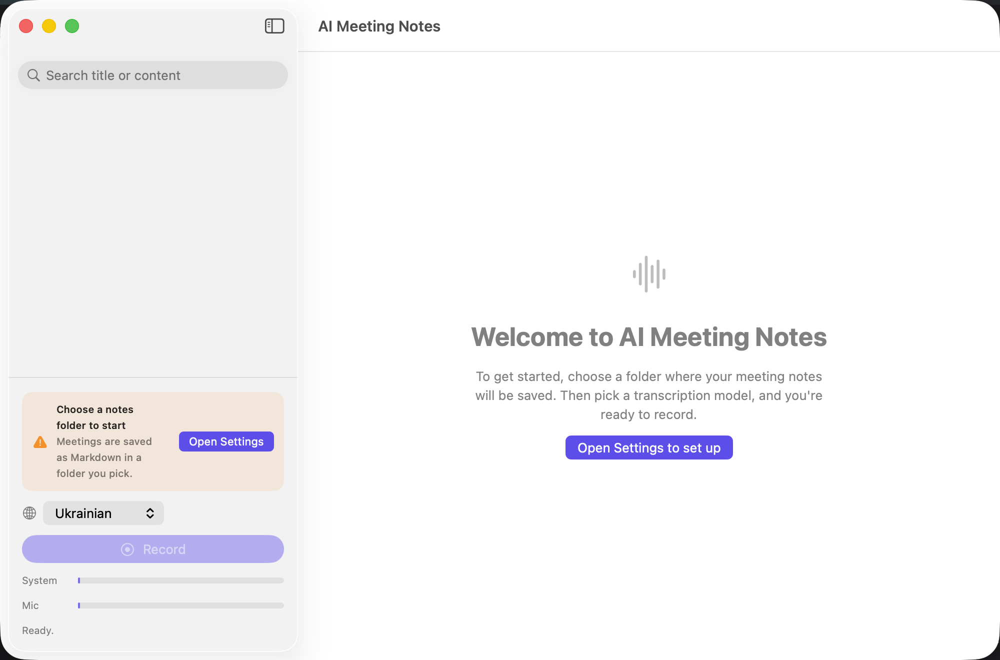
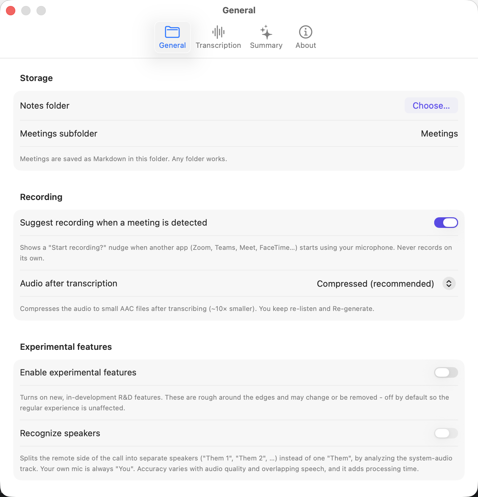
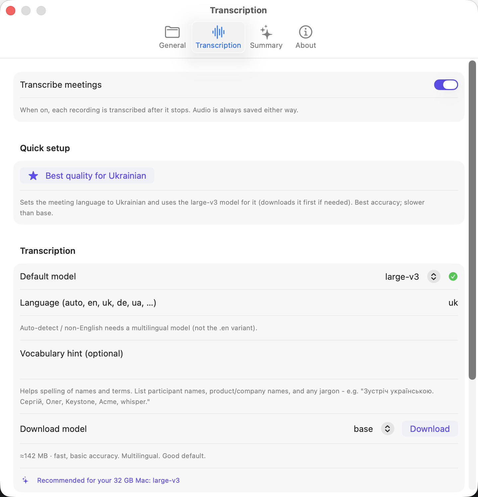
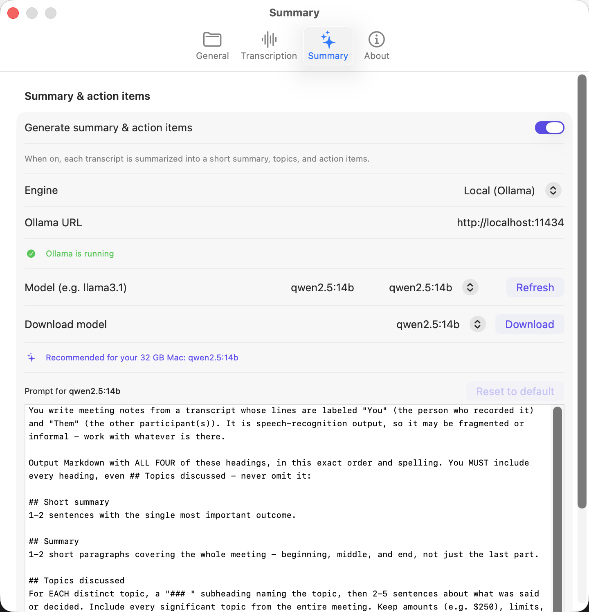
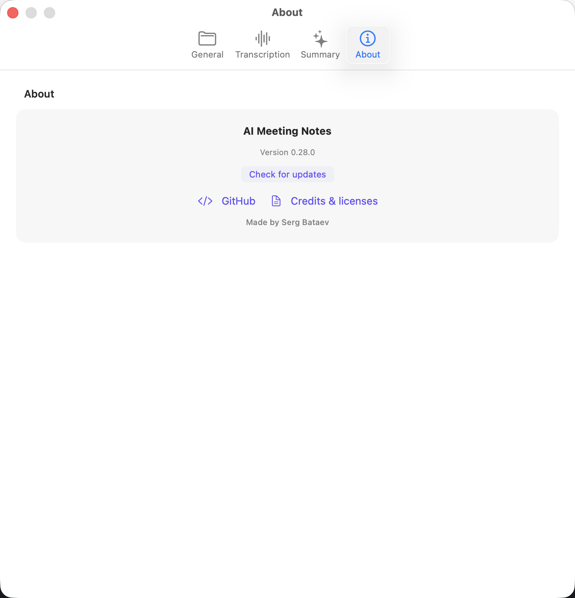

# AI Meeting Notes for macOS - user guide

A step-by-step walkthrough: install the app, set it up once, record your first
meeting, and review the note. Everything runs **locally** on your Mac unless you
opt into the Claude cloud summary.

> 📸 Screenshots are marked like this throughout. Capture each on your Mac
> (⇧⌘4 then Space, click the window) and drop it in `docs/images/` with the
> filename noted - they'll render in this guide.

---

## 1. Install

1. Download the latest **`AI-Meeting-Notes.dmg`** from
   [the website](https://servika.github.io/ai-meeting-notes/) (or the
   [Releases page](https://github.com/servika/ai-meeting-notes/releases)).
2. Open the `.dmg` and **drag “AI Meeting Notes” into Applications**.
3. Launch it from Applications. It's **signed & notarized by Apple**, so it opens
   with no “unidentified developer” warning.

> 📸 `images/01-install-dmg.png` - the DMG window with the app + Applications shortcut.

---

## 2. First run - choose where notes are saved

On first launch the main window guides you to set up.

1. The window shows **“Welcome to AI Meeting Notes”** with an **Open Settings to
   set up** button. Click it (or press **⌘,** any time).
2. In **Settings → General → Storage**, click **Choose…** and pick a folder for
   your notes. **Any folder works** - if it's an Obsidian vault, the notes show up
   there too, but Obsidian is optional. Notes are saved as plain Markdown.

---

## 3. Download a transcription model

In **Settings → Transcription**:

1. Make sure **Transcribe meetings** is on (top of the tab).
2. Under **Download model**, pick one (start with **base** - fast and accurate
   enough for most calls) and click **Download**. A progress bar shows the download;
   bigger models (`small`, `medium`, `large-v3`) are more accurate but slower.
3. Set **Language** to `auto` (or a specific language for best accuracy). A green
   ✓ next to the model means it's ready.

---

## 4. (Optional) Set up summaries

Summaries are optional. In **Settings → Summary**:

- Turn on **Generate summary & action items**.
- Pick an **engine**:
  - **Local (Ollama)** - fully on-device. If Ollama isn't installed/running, the
    tab guides you: **Download Ollama** → **Open Ollama** → then **Download** a
    model right in the app (recommended size for your Mac is shown).
  - **Claude API** - paste your API key; transcript text is sent to Anthropic.
- Leave it off to get transcript-only notes.

---

## 5. Record a meeting

1. Click **Record** in the left panel.
2. The **first time**, macOS asks permission to record **system audio** and the
   **microphone** - click **Allow** for both. (You may need to do this once per
   permission.)
3. The **System** and **Mic** level meters move as audio comes in - your mic *and*
   everyone else on the call are captured as two separate tracks (no virtual audio
   device needed).
4. When the meeting ends, click **Stop & Transcribe**. You'll see a progress bar
   with a live time estimate while it transcribes (and summarizes, if enabled).

> 💡 If another app (Zoom, Teams, Meet, FaceTime) starts using your mic, the app
> nudges you to record - and sends a macOS notification with a **Record** button
> if it's in the background.

> 📸 `images/06-recording.png` - recording in progress with the level meters moving.
> 📸 `images/07-processing.png` - the “Transcribing… ~X left” progress state.

---

## 6. Review the note

When processing finishes, the new meeting appears in the **sidebar** and opens on
the right with:

- A **short summary**, **summary**, **topics**, and **action items** (if summaries
  are on).
- A **speaker-labeled transcript** - every line tagged **You** or **Them**.
- The note is saved as Markdown in your folder; the audio sits alongside in
  `recordings/`.

> 📸 `images/08-meeting-note.png` - a finished meeting (summary + transcript).

---

## 7. Manage a meeting

From the meeting's toolbar (top-right of the detail view):

- **Rename** (✏️) - change the title; the audio stays linked.
- **Re-transcribe** (↻) - re-run transcription/summary with your current settings
  (e.g. after switching to a better model). It never changes the audio.
- **Compress audio** (⤡) - appears when the recording is still high-quality WAV;
  shrinks it to a small `.m4a` (~10× smaller) **without** re-transcribing.
- **Delete** (🗑) - removes the note and its recordings.

You can also set the default behavior in **Settings → Recording → “Audio after
transcription”**: *Compressed* (default), *Best quality (keep original)*, or
*Delete (text only)*.

> 📸 `images/09-toolbar.png` - the meeting toolbar (rename / re-transcribe / compress / delete).

---

## 8. Staying up to date

The app checks for new versions once a day. When one's available, a
**“Version X is available - Download”** bar appears at the top of the window.
You can also check manually in **Settings → About → Check for updates**.

> 📸 `images/10-update-bar.png` - the “update available” bar (shown when a newer version exists).

---

## Privacy

Recording, transcription, and (with Ollama) summarizing all happen on your Mac.
The only time anything leaves your machine is if you choose the **Claude API**
summary engine. See the in-app **Settings → About → Credits & licenses** for the
open-source components this is built on.